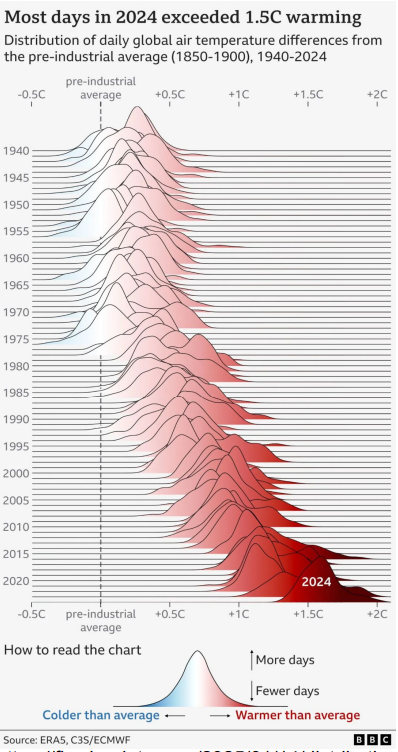
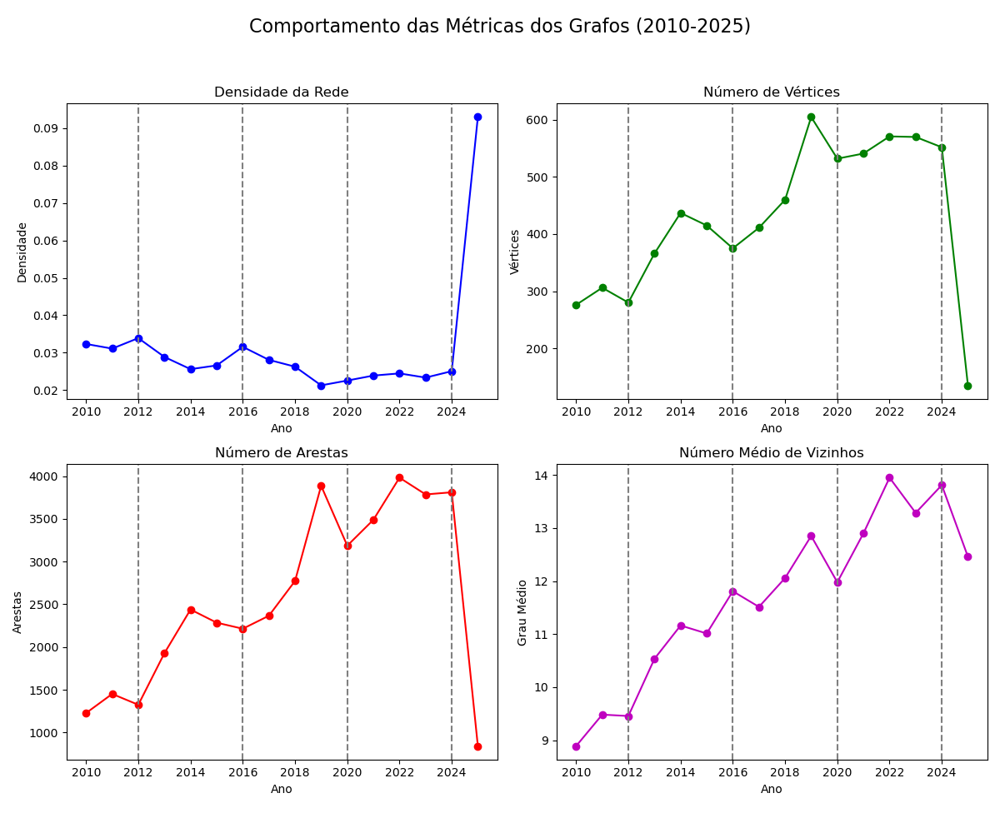
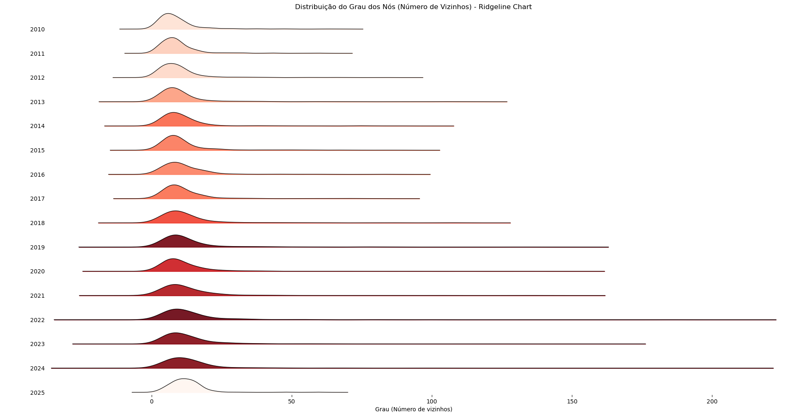
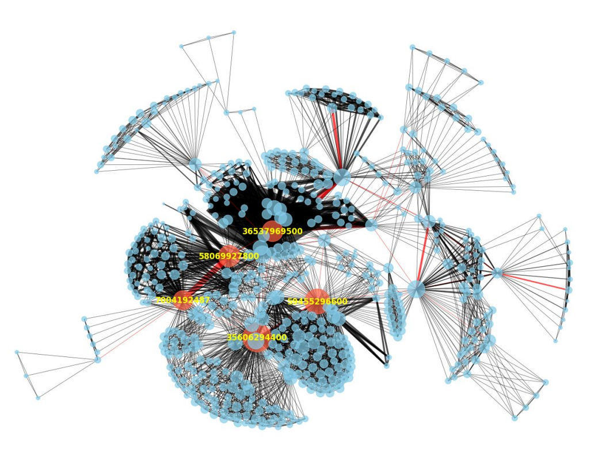
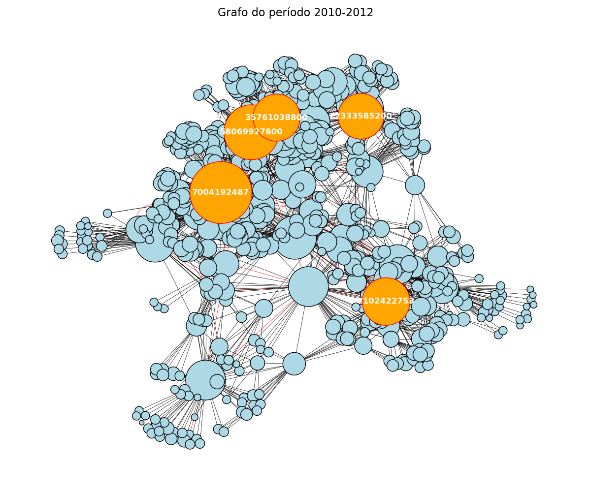
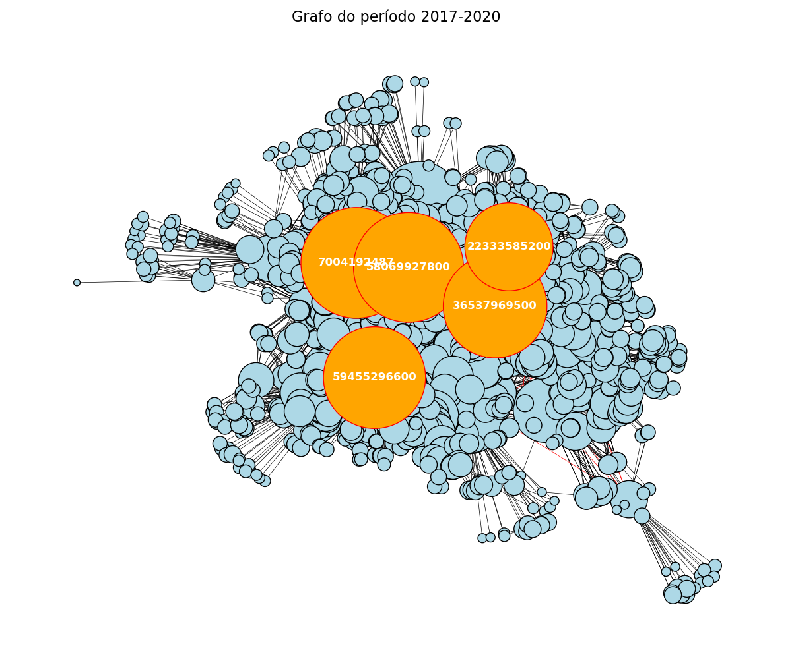
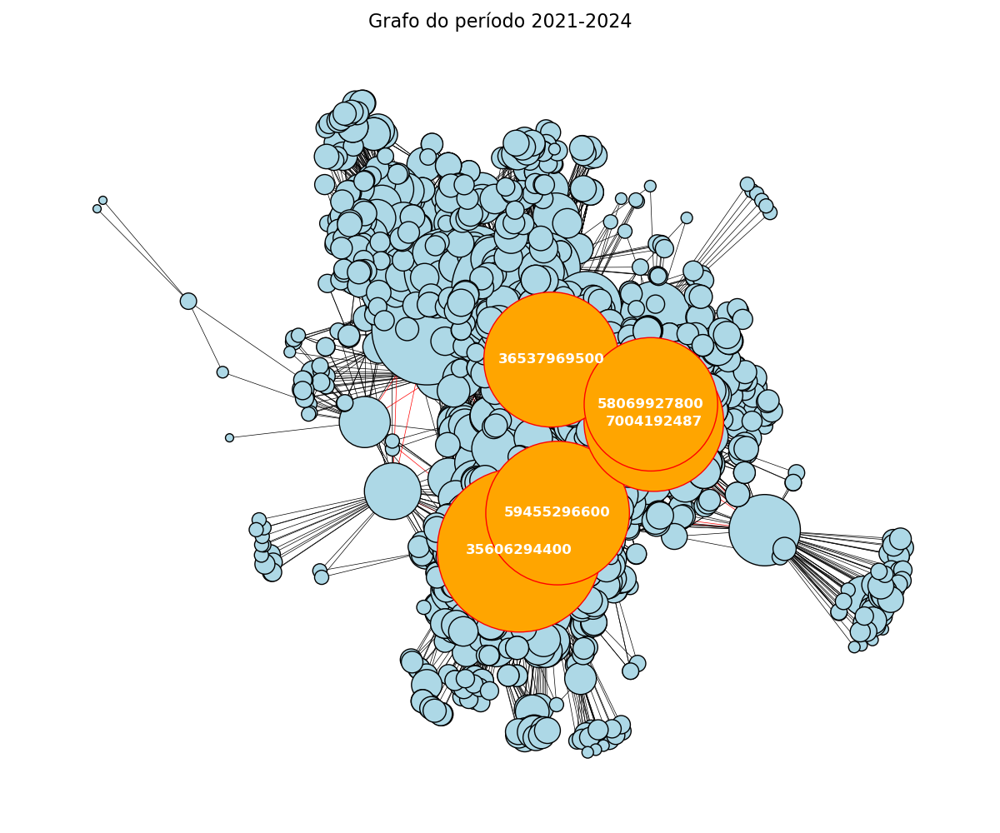
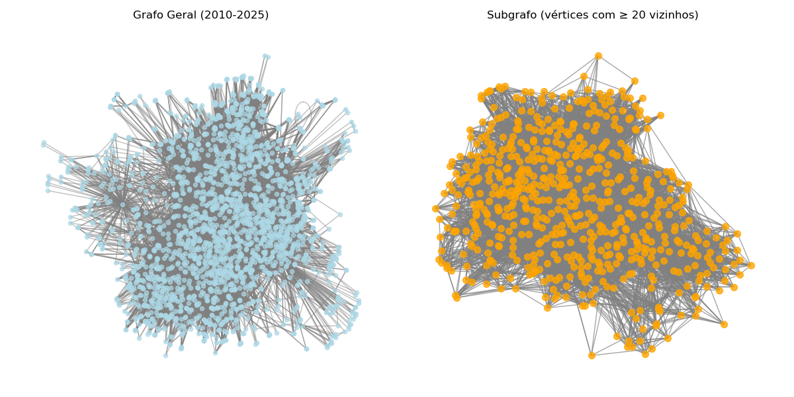
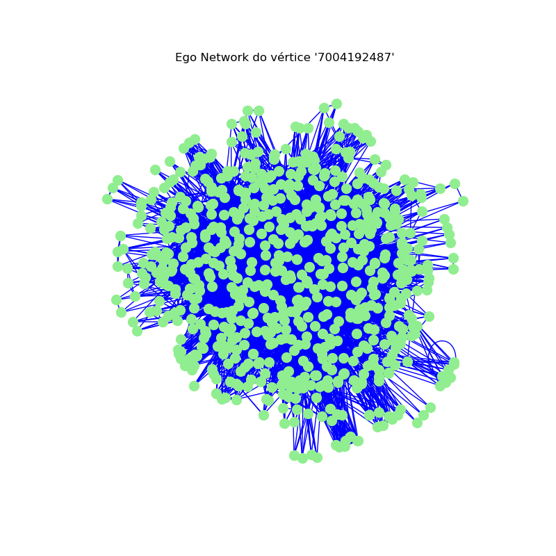

# U1P1_graph_analysis
Repositório criado para o primeiro projeto da primeira unidade da disciplina AED II 

# Análise da Rede de Co-autoria do PPgEEC

Este repositório contém o projeto 1 da primeira unidade da disciplina de Algoritmos e Estruturas de Dados II, que consiste na criação e análise de uma rede de co-autoria utilizando dados reais disponibilizados pelo PPgEEC.

## Índice

- [Contexto do Projeto](#contexto-do-projeto)
- [Primeira Análise](#primeira-análise)
  - [Objetivos](#objetivos)
  - [Metodologia e Ferramentas](#metodologia-e-ferramentas)
  - [Resultados e Observações](#resultados-e-observações)
- [Segunda Análise](#segunda-análise)
  - [Objetivos](#objetivos-1)
  - [Metodologia e Ferramentas](#metodologia-e-ferramentas-1)
  - [Resultados e Observações](#resultados-e-observações-1)
- [Terceira Análise](#terceira-análise)
  - [Objetivos](#objetivos-2)
  - [Metodologia e Ferramentas](#metodologia-e-ferramentas-2)
  - [Resultados e Observações](#resultados-e-observações-2)
- [Desafios Encontrados](#desafios-encontrados)
- [Considerações Finais](#considerações-finais)

---

## Contexto do Projeto

O projeto tem como foco a análise de uma rede de co-autoria composta por dados reais do PPgEEC. Foram analisados aspectos temporais e estruturais da rede, considerando o comportamento dos autores e suas relações ao longo dos anos.

Grupo : Gustavo Pereira de Carvalho
              Matheus Bezerra Dantas Saraiva

---

## Primeira Análise

### Objetivos

- Analisar a série temporal da rede de co-autoria no período de **2010 a 2025**.
- Extrair métricas relevantes: densidade da rede, número de vértices, número de arestas e número médio de vizinhos.
- Plotar curvas que ilustrem o comportamento dessas métricas ao longo dos anos, com marcos para os anos de **2012, 2016, 2020** e **2024** (períodos de avaliação do PPgEEC).
- Calcular e visualizar a distribuição do número de vizinhos através de um histograma no estilo **Ridgeline Chart**.

### Metodologia e Ferramentas

Para esta análise, foi utilizada a biblioteca [NetworkX](https://networkx.github.io/) para manipulação dos grafos, e a biblioteca [Joypy](https://github.com/sbebo/joypy) para a criação dos gráficos do estilo Ridgeline.  
A criação dos códigos contou com o auxílio do Chat GPT a partir dos seguintes _prompts_:

```plaintext
"Preciso avaliar o comportamento de uma série temporal. Os dados estão organizados em grafos, na forma de arquivos com extensão (.gexf). Os arquivos estão no formato 'ano_authors_network.gexf' e variam de 2010 a 2025. Utilizando a biblioteca NetworkX, faça um programa em Python que extraia as seguintes informações: densidade da rede, número de vértices, número de arestas e número médio de vizinhos. Com essas informações plote gráficos que mostram o comportamento dessas curvas ao longo dos anos. Faça também marcos nos gráficos com linhas tracejadas, nos anos de 2012, 2016, 2020 e 2024 (Anos de avaliação do PPgEEC)."
```

```plaintext
"Agora, preciso avaliar a distribuição do número de vizinhos e para isso preciso criar um histograma - função de densidade de probabilidade. Faça um gráfico no estilo Ridgeline Chart e considere o número de arestas para a cor do gráfico. Use a imagem enviada como referência para o gráfico."
```


### Resultados e Observações

- **Crescimento dos Autores e Conexões:**  
  - Foi observado um crescimento no número de vértices, arestas e no número médio de vizinhos ao longo dos anos.
  - A densidade da rede apresenta um decréscimo gradual, sugerindo que, embora haja um aumento do número de colaborações, o crescimento de autores é ainda mais acentuado.
  - Algumas discrepâncias no ano de 2025 foram notadas, o que é esperado, pois os dados desse período não são tão completos.

- **Distribuição dos Vizinhos:**  
  - A distribuição do número de vizinhos se mantém em torno de 10 ao longo dos anos.
  - Observa-se uma mudança na tonalidade dos gráficos com o passar do tempo, indicando um aumento no número de arestas e, consequentemente, nas colaborações.

- **Desafio Técnico:**  
  - A criação do Ridgeline Chart foi um dos maiores desafios devido à complexidade do gráfico, exigindo a criação de um código específico com base em uma imagem de referência.





---

## Segunda Análise

### Objetivos

- Analisar a rede de co-autoria em períodos específicos: **2010-2012, 2013-2016, 2017-2020 e 2021-2024**.
- Visualizar os grafos considerando os seguintes requisitos:
  - Tamanho do vértice proporcional ao número de vizinhos.
  - Destaque para os top 5 vértices com maior número de vizinhos.
  - Cor da aresta:  
    - Vermelha para ligações entre membros permanentes do PPgEEC (propriedade `is_permanent: True`).
    - Preta caso contrário.
  - Largura da aresta proporcional à quantidade de citações (`citation_num`).

### Metodologia e Ferramentas

Foi utilizado o Chat GPT para criar o código em Python com base no seguinte _prompt_:

```plaintext
"Agora preciso avaliar a rede em períodos específicos de avaliação, 2010 a 2012, 2013 a 2016, 2017 a 2020 e 2021 a 2024. Os arquivos dos grafos estão no formato (2010-2012.gexf). Para isso, plote os dados em forma de grafo, com as seguintes restrições: O tamanho do vértice será proporcional ao número de vizinhos, destacando os top 5 vértices com mais vizinhos; a cor da aresta deve ser vermelha em caso de uma ligação entre membros permanentes do PPgEEC (propriedade do vértice 'is_permanent': True) e preta caso contrário; a largura da aresta deve ser proporcional à quantidade de citações (propriedade do vértice 'citation_num'). Use a imagem enviada como referência, mas mantenha as restrições informadas."
```

Devido a restrições iniciais, um segundo _prompt_ foi utilizado para ajuste fino:

```plaintext
"Ajuste os grafos de forma que cada grafo seja plotado separadamente, aproveitando melhor o espaço (de forma que os vértices não fiquem tão amontoados) e destacando os top 5 vértices para cada grafo individualmente."
```


### Resultados e Observações

- Foi observado o aumento no número de vértices, o que confirma os resultados da primeira análise.
- Houve uma concentração de colaborações entre autores permanentes.
- O tamanho dos vértices aumentou, refletindo o crescimento do número de vizinhos, especialmente entre os autores mais conectados.






- **Desafio Técnico:**  
  - Especificar todos os requisitos simultaneamente para que o código atenda a todas as restrições foi um dos maiores desafios desta etapa.

---

## Terceira Análise

### Objetivos

- Realizar uma análise integrativa utilizando todos os dados de **2010 a 2025**.
- Criar um subgrafo a partir do grafo geral, considerando apenas os vértices com pelo menos **20 vizinhos**.  
  - Esse número foi escolhido considerando que, em 2024, o número médio de vizinhos era 14, assim o filtro destaca autores com conexões acima da média.
- Comparar a densidade entre o subgrafo e o grafo geral.
- Analisar a rede ego do vértice com o maior número de arestas.

### Metodologia e Ferramentas

Utilizando o Chat GPT, foi desenvolvido um código em Python com o seguinte _prompt_:

```plaintext
"Gere um subgrafo da rede geral (2010-2025), contendo os vértices que possuem pelo menos 20 vizinhos. Depois calcule a densidade do subgrafo e do grafo geral e imprima os resultados. Após isso, gere uma visualização do subgrafo e do grafo geral. Por fim, selecione o vértice com mais arestas e analise sua rede ego."
```

**Saída do código:**

```plaintext
Grafo geral carregado com 2454 vértices e 26113 arestas.
Subgrafo gerado com 633 vértices e 10391 arestas (vértices com grau >= 14).

Densidade do grafo geral: 0.0087  
Densidade do subgrafo: 0.0519

Vértice com mais arestas: '7004192487' com grau 711
```

### Resultados e Observações

- **Subgrafo versus Grafo Geral:**
  - O subgrafo apresenta uma densidade significativamente maior devido à restrição aplicada, o que concentra os vértices mais conectados.
  - Observa-se uma diminuição no número de vértices no subgrafo, sugerindo que poucos autores possuem pelo menos 20 conexões.

- **Rede Ego:**
  - A análise da rede ego do vértice com o maior número de arestas revela um elevado número de conexões entre os vértices associados, indicando que os vizinhos do vértice central também possuem um forte nível de interconexão.




- **Desafio Técnico:**  
  - Relacionar de forma clara e eficaz o subgrafo com o grafo geral e extrair informações da rede ego foram os principais desafios desta etapa.

---

## Desafios Encontrados

- **Primeira Análise:**  
  - Integração do código para o Ridgeline Chart, que exigiu atenção especial ao formato e aos parâmetros do gráfico.
  
- **Segunda Análise:**  
  - Especificação exata de múltiplos requisitos para a visualização dos grafos de diferentes períodos sem comprometer a clareza dos dados.
  
- **Terceira Análise:**  
  - Relacionar a análise do subgrafo com o grafo geral e a extração da rede ego, mantendo coerência na comparação das métricas.

---

## Considerações Finais

A análise da rede de co-autoria do PPgEEC permitiu uma compreensão profunda dos padrões de colaboração entre autores ao longo do tempo, destacando o crescimento dos autores e das conexões, bem como as nuances das colaborações entre membros permanentes e outros colaboradores. Cada etapa da análise apresentou seus desafios, os quais foram superados com o auxílio de ferramentas modernas e abordagens iterativas para a modelagem dos dados.

---
